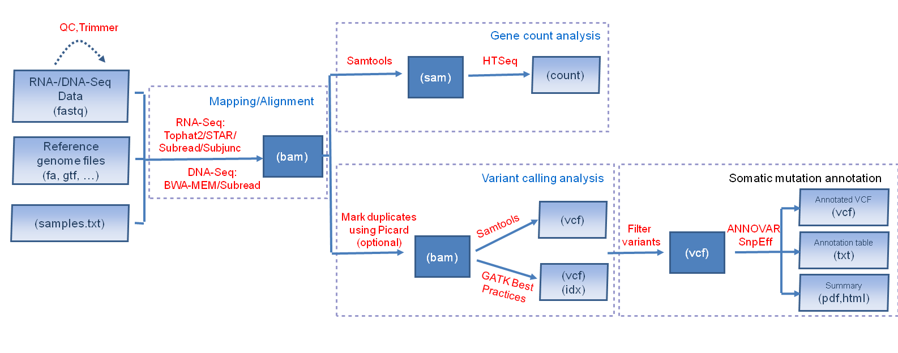

BRB-SeqTools is a user-friendly pipeline tool that includes many well-known software applications designed to help general scientists preprocess and analyze Next Generation Sequencing (NGS) data. 




## OS & Hardware Requirements

BRB-SeqTools can be run on Ubuntu OS and macOS. We give detailed instructions below for setting it up on each operating system.

## Setting up BRB-SeqTools

### Download BRB-SeqTools

The tarball can be extracted to the desktop or any other place under your $HOME directory by using either the file manager (called Nautilus in Ubuntu) or a terminal command (use the keyboard shortcut 'Ctrl+Alt+t' to open a terminal).

```{bash eval = FALSE}
tar -xzvf seqtools-dl-1.2.tar.gz
```

This will create a new directory called seqtools-dl. This new directory contains the following files:

- `SeqTools`: GUI version of the application
- `seqtools_dge/seqtools_vc`: CLI version of the application

### Launch BRB-SeqTools